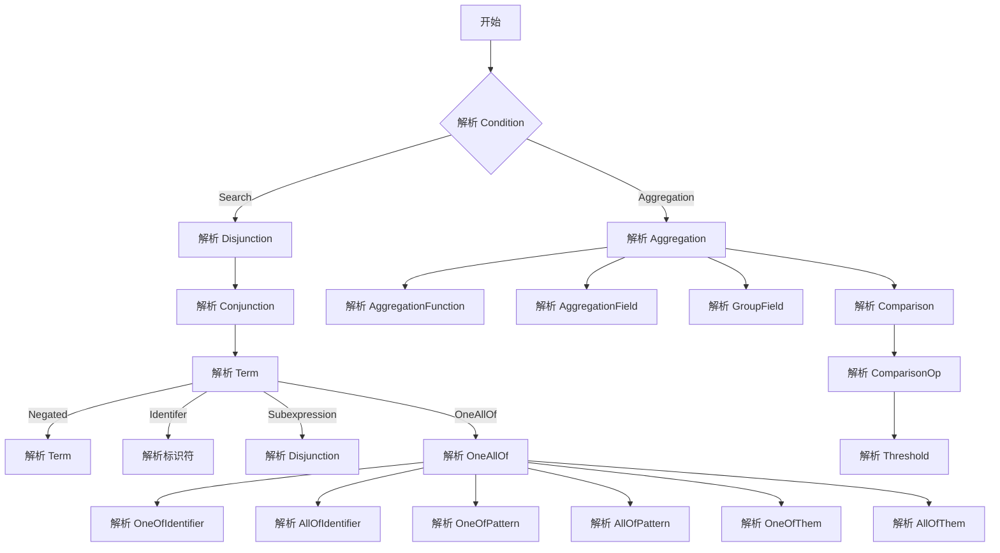
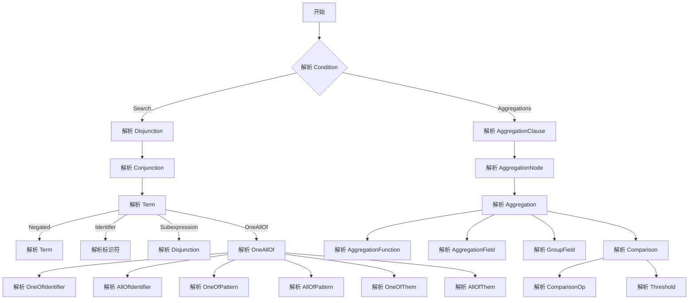

# 需求


## sigma 事件聚合
- 描述：我如果想要一个47668事件在60s内出现超过一百次，同时出现的特定字段去重后超过20次，该怎么写啊
- 转换成了 and ， 可以写成 cep。

### 实现方法
- 更改condition解码， 添加递归解码效果
- 但是解码的时候， 是否需要新的解码方法，  

## sigma 算子split
- 这个简单可行
- 当前定义为，只有存在this。 
- 之后定义为， 在 selection 的元素中添加 split()[] 语法， 并通过正则匹配来解析。

### 实现方法
- 对于 this 的解析进行改进， 解码出split元素。 
## cep 进行不包含匹配

### 实现方法
- 添加了not感知节点， 并对 relation 解码进行了一些修改。
agg + AggrationNode condition, pipeNod + con 
# background

## 词法解析

alecthomas/participle/lexer 是 participle 库中用于词法分析的部分，participle 是一个功能强大的用于 Go 语言的解析库，旨在轻松创建递归下降解析器。以下是对 alecthomas/participle/lexer 库的详细解析：
1. 

### 词法分析器（Lexer）
词法分析器（Lexer）是计算机科学中的一个概念，用于将输入文本分解为标记（Tokens）的过程。在编程中，词法分析器用于将源代码（比如编程语言的源代码）分解为更小的单元，这些单元通常称为“词素”（Tokens）。词素可以是关键字、标识符、数字、字符串等。词法分析器的主要目的是确定输入文本中的每个词素的类型，以便进一步进行处理。


#### sigma
- <Keyword>
- <SearchIdentifierPattern>
- <SearchIdentifier>
- <refu
# 匹配机制

```
aaazaaazaaaz
```

```


```


# RETE

## background 
- 构造+匹配而已， 不用考虑太多
- you shit , fuck you
- f
## 


- 对condition 的 parse 使用简单的解析方法， 解析成许多 and 的 or 。（这里还是走了 ParseCondition 函数解析成算符）
- 每个 and 是一个最小单元。 满足所有条件
- 一个token
- 一个production 包含一个LHS 和一个RHS， 
- LHS 包含一个 BaseBata 列表和一个正负号标志。
- RHS 包含cep id
- 

   1)如果WME的类型和根节点的后继结点TypeNode(alpha结点的一种)所指定的类型相同，则会将该事实保存在该TypeNode结点对应的alpha存储区中，该WME被传到后继结点继续匹配，否则会放弃该WME的后续匹配；
   2)如果WME被传递到alpha结点，则会检测WME是否和该结点对应的模式相匹配，若匹配，则会将该事实保存在该alpha结点对应的存储区中，该WME被传递到后继结点继续匹配，否则会放弃该WME的后续匹配：
   3)如果WME被传递到beta结点的右端，则会加入到该beta结点的right存储区，并和left存储区中的Token进行匹配(匹配动作根据beta结点的类型进行，例如：join，projection，selection)，匹配成功，则会将该WME加入到Token中，然后将Token传递到下一个结点，否则会放弃该WME的后续匹配：
   4)如果Token被传递到beta结点的左端，则会加入到该beta结点的left存储区，并和right存储区中的WME进行匹配(匹配动作根据beta结点的类型进行，例如：join，projection，selection)，匹配成功，则该Token会封装匹配到的WME形成新的Token，传递到下一个结点，否则会放弃该Token的后续匹配；
   5)如果WME被传递到beta结点的左端，将WME封装成仅有一个WME元素的WME列表做为Token，然后按照 4) 所示的方法进行匹配：
   6)如果Token传递到终结点，则和该根结点对应的规则被激活，建立相应的Activation，并存储到Agenda当中，等待激发。

   7)如果WME被传递到终结点，将WME封装成仅有一个WME元素的WME列表做为Token，然后按照 6) 所示的方法进行匹配；


   功能实现限制
   1. relation 匹配法具有限定
   2. condition 无法增添新语法

功能实现方案
方案一（对立事件）：
不改变网络结构， 通过解码 event_mapping 添加对应的对立事件， 当该事件发生时删除对立事件， 当该事件删除时添加对立事件。 规则写为检查是否存在对立事件。
优点：好写, 逻辑变动少。
缺点：增加大量无用事件占内存，增加网络复杂度， 语法扩展性不好。 
z
```yaml
detection:
    timeframe: 10s
    event_mapping:
      event1: 104488
      event2: 104489
      event3: -104490 
    relation:
      event1.Image == event2.CallingProcessPath
    condition: event1 and event2 and event3    
```


token:
- event1
- 
方案二：
增加 Not 节点。 激活逻辑为判断对应的 alpha 是否为空， 来对 Not 进行激活和删除。  

表达方式可再定， 若能成功获取， 则以下写法可。

```yaml
detection:
    timeframe: 10s
    event_mapping:
      event1: 104488
      event2: 104489
      event3: 104490
    relation:
      event1.Image == event2.CallingProcessPath
      not(event3)
    condition: true   
```

# 节点关系 

上面的例子中， 

仍然是以beta_memory 为间隔, 进行token链的传递, 中间夹着join或者not.

join的效果是通过test来进行过滤, 链接alpha是为了获取表达式中的值.

not的效果是通过alpha来对token进行管控, 

not难以在不同链共用, 因为不同前缀要传给不同后缀.

激活情况有两种, 一种是随链变化, 一种是被alpha激活, 激活时要删除掉后续所有token链.

# 


# negetiva 激活逻辑
- 只存在 alpha 的右激活 和 BETE 的左激活。
- 


# 迁移笔记
- alpha.go 没动
- beta_memory.go 没动
- common, NewBeta 
- condition_parser.go 没动
- engine.go 没动  
- join_node.go  没动
- 


# counter 更改 

counter:ius is  

1. 增加与或非模型
2. 增加管道模型 | 

两个都要， 因为统计模型的前提条件并不同。 

# jia hu, zhen hu 

控制流图：

初始






kangsh

text  -> grammer -> ast -> match 


-> action -> token -> beta_memory -> alpha_memory -> engine -> action -> engine -> action -> engine -> action
- 原来支持多个condition 的， 此时应会产生bug吧

- 原来是支持多个condition 的， 此时应会产生bug吧


###  go participle 指南
- habixia shi xiao gou de yi si 
- 1. 词法分析：将输入的源代码按照一定的规则进行拆分，得到一系列的记号（token）。
- 2. 语法分析：对记号进行解析，根据语法规则进行匹配，得到一个抽象语法树（AST）。
- 3. 语义分析：对AST进行遍历，对每个节点进行语义检查，确保代码逻辑正确。
- 4. 代码生成：根据AST生成目标代码，例如C++代码、Java代码等。
- 5. 链接：将生成的目标代码链接到一起，生成可执行文件。


### 抽象语法树优化

- 统一 sons 
- 遍历子节点， 删除muti and 和 muti search 。
- 癌症晚期， 有没有含金量

- 不好的点， 这边是方法， 然后把主体传过去了。

